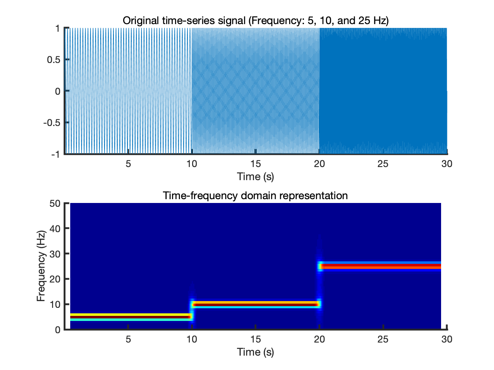
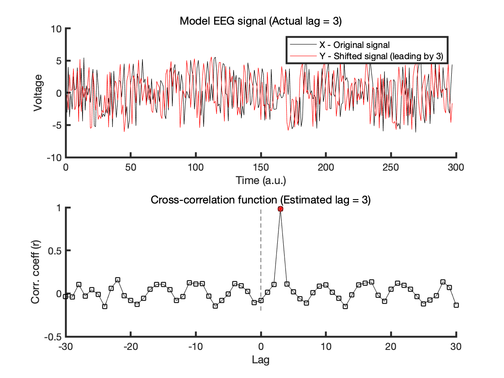
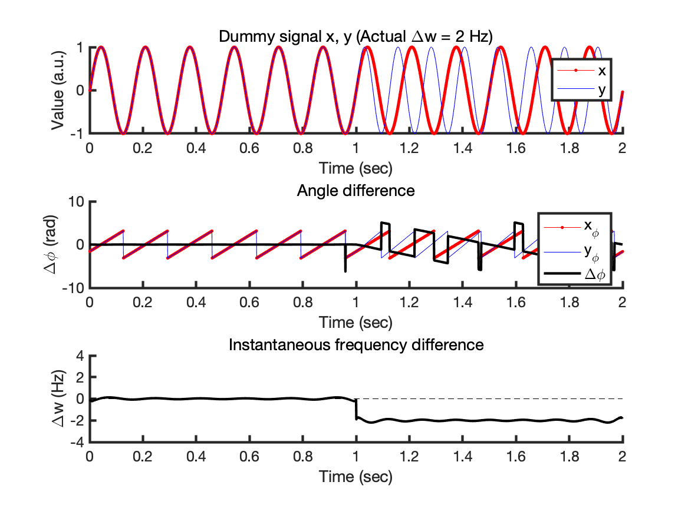

# Matlab functions for analyzing EEG oscillations, including spectrogram, phase synchrony, etc..

This repository is built to share EEG signal processing scripts used in the original research of XXX et al. (*in revision*).

The script [demo.m] contains example usage of each function.

* Related publication: [Hio-Been Han, Ka Eun Lee, & Jee Hyun Choi (2019). **Functional dissociation of theta oscillations in the frontal and visual cortices and their long-range network during sustained attention**, *eNeuro, (4)*, November 2019, ENEURO.0248-19.2019; DOI: 10.1523/ENEURO.0248-19.2019](https://www.eneuro.org/content/early/2019/11/04/ENEURO.0248-19.2019).

  

## List of contents

**1. get_Spectrogram.m**

    [spec_d, spec_t, spec_f] = get_Spectrogram( x, t, win_size, t_resolution )

*Calculating amplitude spectrogram from signal x and time-vector t.*

> - input arguments  x: Raw EEG signal (1-D vector)  y: Time vector (in millisecond resolution)  win_size: Size of sliding moving window (default: 2^10)  t_resolution: Jump size of sliding moving window (unit: sec, default: 0.1 sec)

 

  
**2. get_TimeLag_xcorr.m**

    lag = get_TimeLag_xcorr(x, y, maxlag)

*Calculating time-lag between two time-series signal x, and y*

> - input arguments  x, y: (Filtered) EEG signal (1-D vector)  maxlag: Maximum time lag to consider (default: half signal length)

 

  
**3. get_PhaseSync.m**

    PLV = get_PhaseSync(x, y, [sd])

*Calculating phase locking value (PLV) from filtered time-series signal x and y*

> - input arguments  x, y: Filtered EEG signal (1-D vector)  sd: Standard deviation of outlier-cutting routine (Highly recommended to set around 3-6).

  
**4. get_InstFreqDiff.m**

    ifd = get_InstFreqDiff(x, y, srate)

*Calculating instantaneous frequency differnece (IFD) from filtered time-series signal x and y*

> - input arguments  x, y: Filtered EEG signal (1-D vector)  srate: Sampling rate
 

